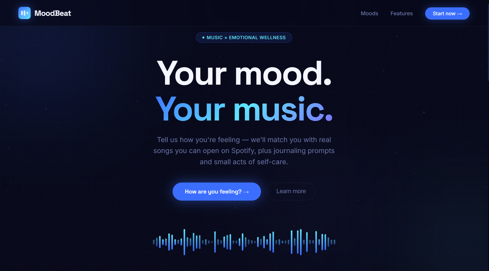

# MoodBeat

MoodBeat is a moodbased music wellness web app that turns emotional check-ins into real song recommendations, Spotify links, audio previews, journaling prompts, tiny self-care actions, and supportive mood guidance.


## Website Preview



## Overview

MoodBeat combines emotional wellness, music recommendation logic, and interactive web design in one lightweight application. The user selects one of eight emotional states, and the app responds with a curated playlist, album or single cover art, Spotify search links, a playable audio preview when available, a personalized journal prompt, a small self-care action, and a short supportive response through the mood companion.

The project is built to be understandable as both a frontend interaction project and a small data-driven recommendation system. The frontend can run directly from `index.html`, while the optional Flask backend provides API routes for recommendations, mood classification, companion responses, and journal export.

## Key Features

### Mood Selection

Users can choose from eight mood spaces:

- Overwhelmed
- Lonely
- Anxious
- Tired
- Happy
- Heartbroken
- Focus
- Healing

Each mood has its own color theme, visual icon, description, target audio profile, journal prompt, and tiny self-care activity.

### Spotify-Connected Song Recommendations

MoodBeat recommends real-world songs stored in `songs.csv`. Each song contains metadata such as title, artist, genre, mood label, duration, Spotify search link, cover URL, and audio-style features including valence, energy, tempo, danceability, acousticness, loudness, instrumentalness, and speechiness.

The app opens each selected song through a Spotify search URL, making the recommendation experience feel connected to real music platforms without requiring a Spotify API key.

### Album and Single Cover Display

Album or single cover art is shown in the player and playlist section after the user selects a mood. Cover images are not shown on the mood cards themselves, so the interface stays clean and the mood selection area remains focused on emotional states.

If a stored cover URL is unavailable, the app creates a fallback cover using the song title, artist name, and current mood color.

### Audio Preview Player

The player supports preview playback when a preview URL is available from the public media search service. Users can play, pause, move to the next track, go back to the previous track, shuffle the playlist, enable loop mode, and seek through the progress bar.

The player also updates the waveform animation, vinyl animation, current time, total duration, and selected track cover based on the active song.

### Playlist Randomization

When a mood is selected, MoodBeat chooses the most suitable songs based on the mood's target audio profile. When the same mood is selected again through the change mood behavior, the playlist is randomized to make the recommendations feel more varied.

### Audio Feature Insights

For each active song, the player displays:

- Valence, representing the emotional brightness of the track
- Energy, representing how intense or active the track feels
- BPM, representing the tempo of the track

These values help users understand why a song fits their current mood.

### Journaling Prompt

Every mood includes a tailored journaling prompt. Users can write a private note inside the app, save it locally in the browser, and return to the saved note when they select the same mood again.

Journal entries are stored in `localStorage`, so they stay on the user's browser and are not sent to a remote database.

### Journal Download

After saving a journal entry, the app displays a `Download Journal (.docx)` button. The frontend generates a `.docx` file directly in the browser and includes the mood, date, time, current song companion, and journal entry.

The optional backend also includes a journal export endpoint that can generate an `.rtf` file.

### Tiny Self-Care Act

Each mood provides a small action that fits the user's emotional state. The action is designed to be simple, realistic, and easy to complete, such as breathing practice, reaching out to someone, taking a short break, or starting a focused work session.

### Mood Companion

The mood companion lets users ask a short question about their current mood, the music, or what they are feeling. The frontend first tries to use the backend route. If the backend or external response provider is unavailable, the app falls back to local browser-based responses.

This keeps the feature usable even without external API access.

### Animated and Responsive Interface

The interface includes animated mood cards, floating particles, ripple effects, waveform animation, vinyl animation, scroll reveal behavior, hover interactions, and responsive layouts for smaller screens.

## How the Logic Works

### Recommendation Logic

Each mood has a target audio profile containing valence, energy, and tempo values. Songs are compared against the selected mood using a distance-based scoring method.

```text
score = distance between song audio features and mood target profile
```

The app prioritizes songs that are closest to the selected mood's target emotional profile. Some moods also apply small preference adjustments, such as favoring acoustic tracks for calmer moods or danceable tracks for happier and focus-based moods.

### Mood Classification Logic

The optional backend can classify a mood from audio-style features. If `scikit-learn` is available, it uses a K-Nearest Neighbors model from `mood_model.pkl`. If the model cannot be loaded, the backend falls back to a distance-based comparison against the mood target profiles.

### Cover and Preview Logic

The app first uses the cover URL stored in the song dataset. It then attempts to hydrate the track with higher-quality artwork and preview audio from a public media search endpoint. When a match is found, the current player cover and playlist thumbnail are updated automatically.

### Journal Logic

The frontend saves journal entries by mood in browser `localStorage`. The app only keeps one saved entry per mood by replacing the old entry for that mood with the newest one.

When the user downloads a journal, the app creates a valid `.docx` file in the browser by building the required document XML structure and packaging it as a ZIP-based Office document.

### Mood Companion Logic

The companion sends the current mood, user question, and active track context to the backend. The backend returns either an external generated response or a local fallback response. If the frontend cannot reach the backend, it uses the built-in local response set.

## Project Structure

```text
MoodBeat/
├── index.html
├── api.py
├── songs.csv
├── mood_model.pkl
├── README.md
└── MoodBeatDemo.gif
```

## Installation

### Option 1: Run the Frontend Only

Use this option when you only want to preview the website interface.

```bash
git clone https://github.com/your-username/moodbeat.git
cd moodbeat
```

Then open `index.html` directly in your browser.

### Option 2: Run with the Flask Backend

Use this option when you want the API routes, recommendation endpoint, mood classification endpoint, companion endpoint, and backend journal export.

```bash
git clone https://github.com/your-username/moodbeat.git
cd moodbeat
python -m venv .venv
```

Activate the virtual environment.

For Windows:

```bash
.venv\Scripts\activate
```

For macOS or Linux:

```bash
source .venv/bin/activate
```

Install the dependencies.

```bash
pip install flask flask-cors pandas scikit-learn
```

Run the app.

```bash
python api.py
```

Open the app in your browser.

```text
http://localhost:5000
```
## Usage

1. Open the app.
2. Select the mood that best matches how you feel.
3. View the generated playlist and current song recommendation.
4. Press play to preview the track when preview audio is available.
5. Use `Open in Spotify` to continue listening on Spotify.
6. Check the valence, energy, and BPM values to understand the recommendation.
7. Write a journal entry using the mood-specific prompt.
8. Save the journal entry.
9. Download the journal as a `.docx` file if needed.
10. Ask the mood companion for a short supportive response.
11. Use `Change mood` or reselect the same mood to refresh and vary recommendations.

## API Reference

### `GET /`

Serves the `index.html` frontend.

### `GET /health`

Returns backend health information, model readiness, song count, and supported moods.

### `GET /api/moods`

Returns the available moods and their display metadata.

### `GET /api/songs/<mood>`

Returns all songs that belong to a specific mood.

Example:

```bash
curl http://localhost:5000/api/songs/happy
```

### `POST /api/recommend`

Returns recommended songs for a mood.

Example body:

```json
{
  "mood": "happy",
  "n": 8,
  "randomize": true
}
```

### `POST /api/classify`

Classifies a mood from audio-style features.

Example body:

```json
{
  "features": {
    "valence": 0.7,
    "energy": 0.6,
    "tempo": 110,
    "danceability": 0.65,
    "acousticness": 0.3
  }
}
```

### `POST /api/ai_chat`

Returns a short supportive companion response based on the current mood, user question, and active track.

Example body:

```json
{
  "mood": "healing",
  "question": "Why do I still feel stuck?",
  "lang": "en",
  "track": {
    "title": "Rainbow",
    "artist": "Kacey Musgraves",
    "genre": "country pop",
    "valence": 0.57,
    "energy": 0.34
  }
}
```

### `POST /api/journal/export`

Exports a journal entry as an `.rtf` file from the backend.

Example body:

```json
{
  "mood": "focus",
  "text": "Today I want to finish one important task.",
  "track": {
    "title": "Intro",
    "artist": "The xx"
  }
}
```

## Built With

- HTML
- CSS
- JavaScript
- Python
- Flask
- Pandas
- Scikit-learn
- Browser `localStorage`
- Public media search for preview audio and artwork
- Spotify search links
